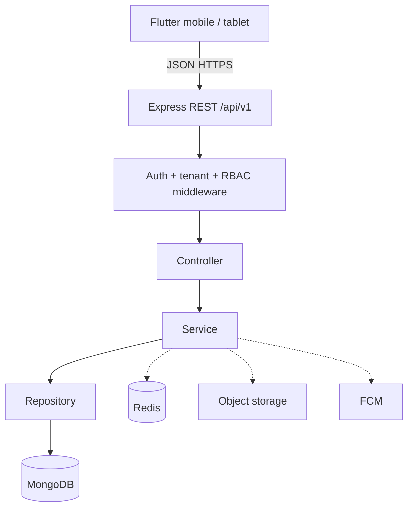

# Backend Architecture

Node.js, Express, TypeScript, REST, JWT, RBAC, MongoDB.

INFRA-001 already provides `config/`, `modules/health/`, `middlewares/`, `routes/`, `services/`, `types/`, `utils/`, `app.ts`, and `server.ts`. This document is the target for AUTH-001 onward. Do not add empty feature modules in ARCH-001.

## System context



Redis, object storage, and FCM are supporting services. They are not the source of truth for students, events, or attendance.

## Target layout

```
apps/api/src/
├── config/                 # env, MongoDB, Redis
├── modules/
│   ├── health/             # exists
│   ├── auth/
│   ├── organizations/
│   ├── platform/          # PLATFORM-001/002 SaaS console + platform-admin bootstrap
│   ├── subscriptions/     # plan limits / feature checks
│   ├── invitations/
│   ├── audit/
│   ├── users/
│   ├── campuses/
│   ├── students/
│   ├── classrooms/
│   ├── guardians/          # student–guardian links, not a second identity
│   ├── attendance/
│   ├── journey/            # student_events
│   ├── buses/
│   ├── activities/
│   ├── media/
│   └── notifications/
├── authorization/          # permissions, resource-scope helpers
├── data/                   # tenantFilter / withTenant
├── middlewares/            # authenticate, tenantContext, authorize, error, notFound
├── services/               # cross-module only (keep rare)
├── utils/
├── types/
├── app.ts
└── server.ts
```

Create a module when its ticket starts. Each feature module owns:

| File | Responsibility |
| --- | --- |
| `*.routes.ts` | Path + HTTP method + middleware chain |
| `*.controller.ts` | Parse request, call service, write HTTP response |
| `*.service.ts` | Business rules |
| `*.repository.ts` | MongoDB access, always tenant-scoped |
| `*.types.ts` | Module types (optional if small) |

Shared helpers stay in `middlewares/`, `config/`, `utils/`. Do not put org-wide business logic in `app.ts` or route files.

## Request flow

```
HTTP request
  → Route
  → Middleware (helmet/cors/json, then auth, tenant, RBAC)
  → Controller
  → Service
  → Repository
  → MongoDB
```

- Route handlers do not contain business rules.
- Controllers do not talk to MongoDB.
- Services do not import `req` / `res`.
- Repositories do not implement RBAC; they receive an already-authorized `organizationId` plus any extra scope ids the service computed (classroomIds, studentIds, routeIds).

## Layers

| Layer | Does | Does not |
| --- | --- | --- |
| Middleware | Authenticate JWT, attach `auth`, reject missing tenant, coarse role checks | Load full domain graphs |
| Controller | HTTP mapping, status codes | Tenant queries |
| Service | Authorization scope (this teacher, this child), invariants, side effects | Raw collection access from several modules without going through their repositories |
| Repository | `find` / `insert` with `{ organizationId, ... }` | Trust client `organizationId` |

## API conventions

Base path: `/api/v1`

Existing: `GET /api/v1/health` → `{ "status": "ok" }`. Leave that shape alone.

### Resources

```
GET    /api/v1/students
GET    /api/v1/students/:id
POST   /api/v1/students
PATCH  /api/v1/students/:id
DELETE /api/v1/students/:id
```

| Method | Meaning |
| --- | --- |
| GET | Read |
| POST | Create |
| PATCH | Partial update |
| DELETE | Soft-delete when the entity supports `deletedAt`; otherwise 405 |

No verbs in paths (`/students/:id/archive` is not the default). Subresources are fine: `/api/v1/students/:id/events`.

### Status codes

| Code | When |
| --- | --- |
| 200 | GET / PATCH success |
| 201 | POST created |
| 204 | DELETE success |
| 400 | Malformed JSON / bad types |
| 401 | Missing or invalid token |
| 403 | Authenticated but not allowed |
| 404 | Unknown **in this tenant** (do not leak cross-tenant existence) |
| 409 | Unique conflict (email, attendance date, idempotency) |
| 422 | Validation failed |
| 429 | Rate limit (later) |
| 500 | Unexpected |

Cross-tenant ids return **404**, not 403, so callers cannot probe other organizations.

### Error body (from AUTH-001)

```json
{
  "error": {
    "code": "VALIDATION_ERROR",
    "message": "classroomId is required",
    "details": [{ "field": "classroomId", "message": "Required" }]
  }
}
```

`details` only for 422.

### Pagination

Admin/staff lists (offset):

```
GET /api/v1/students?page=1&limit=20
```

```json
{
  "data": [],
  "meta": { "page": 1, "limit": 20, "total": 0 }
}
```

Default `limit` 20, max 100.

Timelines (cursor):

```
GET /api/v1/students/:id/events?cursor=...&limit=50
```

```json
{
  "data": [],
  "meta": { "nextCursor": "..." }
}
```

Cursor is opaque. Internally: `occurredAt` + `_id`.

### Filtering and sorting

Allow-list query params per endpoint (`campusId`, `classroomId`, `status`, `date`). Reject unknown filters.

Sort: `sort=-occurredAt` or `sort=name`. Allow-list fields. Default `-createdAt` except events (`-occurredAt`).

### Authentication and authorization

- `Authorization: Bearer <accessToken>`
- Unauthenticated routes: health, `POST /api/v1/auth/login`, `POST /api/v1/auth/refresh`, `POST /api/v1/auth/logout`
- JWT access claims: `sub` (userId), `organizationId`, `role`, `type: "access"`
- Refresh tokens are JWTs with `jti`; logout sets `revokedAt` on that session
- Access token default lifetime `15m` (`JWT_ACCESS_EXPIRES_IN`); refresh default `7d` (`JWT_REFRESH_EXPIRES_IN`)
- `GET /api/v1/auth/me` requires a valid access token and an ACTIVE organization
- Permission checks: `authorize('organizations.read')` (see [authorization.md](./authorization.md)). The mobile app never authorizes by itself.

Versioning: URL prefix `/api/v1`. Breaking changes go to `/api/v2`. Additive fields are allowed in v1.

## MongoDB usage

See [domain-model.md](./domain-model.md) for collections and indexes.

- One database, many tenants via `organizationId` on documents
- AUTH-001 created `users` and `refresh_tokens`. TENANT-001 added `organizations`. PLATFORM-001 extended organizations (lifecycle + plan fields), added `PLATFORM_ADMIN`, `user_invitations`, `audit_logs`, and `/api/v1/platform/*`. PLATFORM-002 adds one-time `bootstrap:platform-admin` (env secrets → hashed `PLATFORM_ADMIN` in Mongo; no permanent env login). STUDENT-001 added `campuses`, `classrooms`, `students`, and `student_guardians`. ATTENDANCE-001 added `attendance`. JOURNEY-001 added `student_events`. MEDIA-001 added `media`. NOTIF-001 added `notifications`, `device_tokens`, and `notification_preferences`. BUS-001 added `buses`, `bus_routes`, `bus_stops`, `route_segments`, `student_transport_assignments`, `daily_transport_plans`, and `route_progress`. Other collections wait for their tickets.

QR scan: `POST /api/v1/attendance/scan` with `{ "qrToken" }`. Lookup is `{ organizationId, qrToken }`. History: `GET /api/v1/attendance?date=&classroomId=&studentId=`. A successful PRESENT scan also inserts `ATTENDANCE_PRESENT`.

Journey: `POST /api/v1/students/:studentId/events`, `GET /api/v1/students/:studentId/events?date=`, `GET /api/v1/students/:studentId/journey/today`.

Media: `POST/GET /api/v1/students/:studentId/media`, `GET /api/v1/parent/children/:studentId/media`, `GET/DELETE /api/v1/media/:mediaId`. Bytes are private; list/get return short-lived signed URLs after authorization.

Notifications: `POST/DELETE /api/v1/notifications/devices`, `GET/PATCH /api/v1/notifications/preferences`, `GET /api/v1/notifications`, `PATCH /api/v1/notifications/:notificationId/read`. Journey events and media uploads enqueue push jobs; FCM runs on `notificationQueue`.

Transport (BUS-001): buses/routes/stops/segments under `/api/v1/buses`, `/api/v1/bus-routes`, `/api/v1/bus-stops`, `/api/v1/bus-route-segments`. Assignments on `/api/v1/students/:studentId/transport` and `/api/v1/bus-routes/:routeId/students`. Daily plan and parent cancel: `/api/v1/students/:studentId/transport/today`, `POST /api/v1/parent/children/:studentId/transport/cancel`. Progress: `POST/GET .../bus-routes/:routeId/progress`. Boarding QR: `POST /api/v1/transport/boarding/scan` (token only). Bulk arrivals: `POST /api/v1/transport/routes/:routeId/register-arrivals` (`source: MANUAL_BULK`). Teacher classroom: `GET /api/v1/transport/classroom/:classroomId/today`. Parent ETA is stop-progress + remaining `RouteSegment` minutes, labeled estimated arrival (not live GPS). GPS is BUS-002.

## Next implementation tickets

1. **ACTIVITY-001** — activities, homework, teacher observations, and parent visibility
2. **PROFILE-001** — allergies, medication, emergency contacts, and authorized pickup people beyond `student_guardians.canPickup`
3. **SCHOOL-001** — staff / classroom assignment model
4. **AI-001** — AI-assisted daily reports / teacher assistance (after structured journey and activity data exists)
5. **BUS-002** — live bus GPS tracking and real-time ETA
