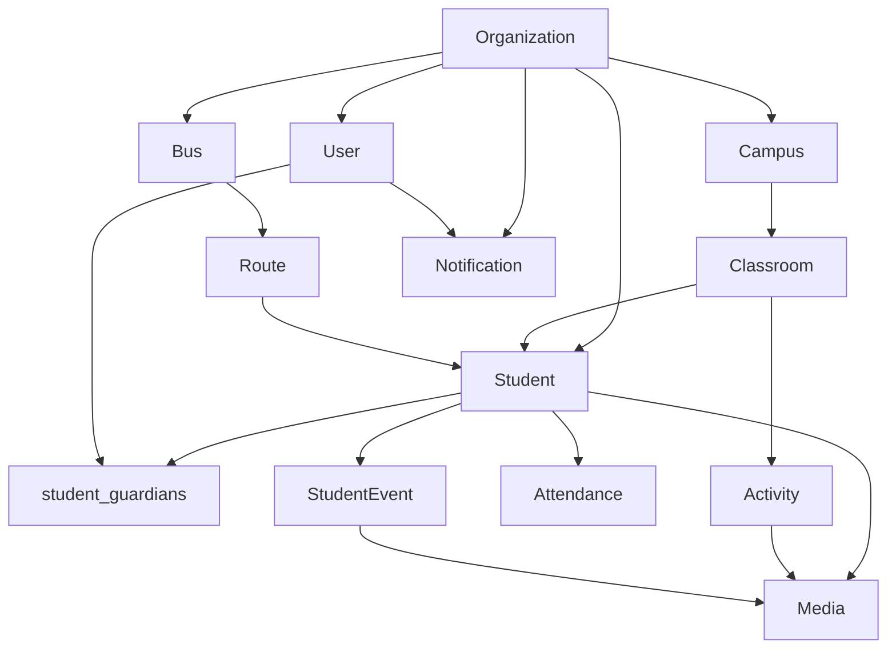

# Domain Model & MongoDB Strategy

ARCH-001 source of truth for entities, relationships, and the collection plan.

AUTH-001 implemented `users` and `refresh_tokens`. TENANT-001 implemented `organizations`. STUDENT-001 implemented `campuses`, `classrooms`, `students`, and `student_guardians`. ATTENDANCE-001 implemented `attendance`. Do not create the remaining collections until their tickets.

## Design decisions

| Decision | Choice | Ceiling / later upgrade |
| --- | --- | --- |
| Tenant root | `Organization` | — |
| Physical location | Every org has at least one `Campus`. Single-site nurseries still store one campus. Status `ACTIVE` \| `INACTIVE` (no hard delete). | Multi-campus already modeled |
| Class membership | A student has one primary `classroomId` | `enrollments` collection if a student joins multiple classes |
| Classroom stage | `level` enum: `NURSERY`, `KINDERGARTEN`, `PRIMARY`, `MIDDLE_SCHOOL`, `HIGH_SCHOOL` | Add values when a new stage is needed |
| Guardian identity | A guardian is a `User` with role `GUARDIAN`. No separate `guardians` collection. Links live in `student_guardians`. | — |
| Student–guardian link | `student_guardians` (many-to-many) | — |
| Student accounts | Students are **not** authenticated users in v1 | Student login if a later stage needs it |
| User tenancy | A user belongs to **one** `organizationId` | `memberships` if a parent has children at two orgs |
| Roles | AUTH-001 stores a single `role`. | `roles[]` if TENANT-001 needs teacher+guardian on one account |
| User name | `firstName` + `lastName` | — |
| User status | `ACTIVE` \| `INACTIVE` | Invites / suspend in a later ticket |
| Daily status | Derived from `student_events`. Optional denormalized cache on `students` | Cache is never the source of truth |
| Events | Append-only. Correct with `voidedAt`, do not delete | — |
| Attendance | Separate daily roll-up in `attendance`, not a flag on the student | QR scan writes PRESENT for the org-local date. Journey events wait for JOURNEY-001 |
| QR payload | Rotatable `qrToken` on the student. Random 32-char hex identifier only, never PII. QR scanning is ATTENDANCE-001. | Rotate token without changing `_id` |

## Relationship overview

```
Organization
├── Campuses
│   └── Classrooms
│       └── Students (primary classroom)
├── Users
│   ├── ADMIN
│   ├── SUPERVISOR  (scoped by campusIds)
│   ├── TEACHER     (scoped by classroomIds)
│   ├── DRIVER      (scoped by routeIds)
│   └── GUARDIAN    (scoped by student_guardians)
├── Buses
│   └── Routes (ordered stops / students)
├── Activities
├── Media
└── Notifications

Student
├── organizationId, campusId, classroomId
├── Guardians  ← student_guardians → Users (GUARDIAN)
├── StudentEvents (timeline)
├── Attendance (one row per student per day)
├── Media
└── Transportation (route stop assignment)
```



## Core entities

Shared on every tenant-owned document unless noted:

- `organizationId` (ObjectId, required)
- `createdAt`, `updatedAt`
- `deletedAt` (Date, optional) — only where soft-delete is specified

MongoDB `_id` is the internal identifier. Do not put `_id` in QR codes.

### Organization

School / company / tenant.

| Field | Type | Notes |
| --- | --- | --- |
| name | string | |
| type | enum | Planned (`NURSERY`, `KINDERGARTEN`, `PRIMARY`, `MIDDLE`, `HIGH`, `MIXED`). Not stored in TENANT-001. |
| status | enum | `ACTIVE`, `INACTIVE` |
| timezone | string | IANA timezone. Default `UTC`. ATTENDANCE-001 uses this for “today”. |

Not tenant-scoped (it **is** the tenant). No `organizationId` on this document.

### Campus

Physical site of an organization.

| Field | Type | Notes |
| --- | --- | --- |
| organizationId | ObjectId | |
| name | string | |
| address | string? | |
| status | enum | `ACTIVE`, `INACTIVE` |

### Classroom

Class / group inside a campus.

| Field | Type | Notes |
| --- | --- | --- |
| organizationId | ObjectId | |
| campusId | ObjectId | |
| name | string | |
| level | enum | `NURSERY`, `KINDERGARTEN`, `PRIMARY`, `MIDDLE_SCHOOL`, `HIGH_SCHOOL` |
| teacherIds | ObjectId[] | Users with TEACHER (denormalized; `users.classroomIds` is the authz source) |
| status | enum | `ACTIVE`, `INACTIVE` |

### User

Authenticated person. Students are not users.

| Field | Type | Notes |
| --- | --- | --- |
| organizationId | ObjectId | v1: exactly one org |
| email | string | Unique globally in v1 |
| passwordHash | string | Never returned by the API |
| firstName | string | |
| lastName | string | |
| role | enum | `ADMIN`, `SUPERVISOR`, `TEACHER`, `DRIVER`, `GUARDIAN` |
| status | enum | `ACTIVE`, `INACTIVE` |
| campusIds | ObjectId[] | SUPERVISOR assignment; empty = no campuses |
| classroomIds | ObjectId[] | TEACHER assignment; empty = no classes |

Assignment scope: `campusIds` (supervisor) and `classroomIds` (teacher) are stored on the user. `routeIds` wait for BUS-001. Guardian child access is **not** stored on the user. It lives in `student_guardians`. Empty assignment lists mean no rows.

### Student

Enrolled child. Must belong to an organization. Campus and classroom are required in v1.

| Field | Type | Notes |
| --- | --- | --- |
| organizationId | ObjectId | |
| campusId | ObjectId | |
| classroomId | ObjectId | Primary class |
| firstName | string | |
| lastName | string | |
| dateOfBirth | Date | |
| gender | enum | `MALE`, `FEMALE`, `OTHER` |
| studentNumber | string | Unique per organization |
| qrToken | string | Random, unique per org, rotatable. Never contains PII. |
| status | enum | `ACTIVE`, `INACTIVE`, `TRANSFERRED`, `GRADUATED` |
| currentStatus | string? | Denormalized latest event type. Cache only. JOURNEY-001. |
| currentStatusAt | Date? | Cache only |

No hard delete. Historical attendance/journey tickets will keep referencing these rows.

### student_guardians

Join between a student and a guardian user.

| Field | Type | Notes |
| --- | --- | --- |
| organizationId | ObjectId | |
| studentId | ObjectId | |
| userId | ObjectId | User with `GUARDIAN` |
| relationship | enum | `MOTHER`, `FATHER`, `LEGAL_GUARDIAN`, `OTHER` |
| isPrimary | boolean | |
| canPickup | boolean | Authorized to collect the child |
| receivesNotifications | boolean | |

A student may have many guardians. A guardian may have many students. Both directions are required.

### StudentEvent

One fact in the student's daily journey. Source of truth for timeline, latest status, history, notifications, reports, analytics, and later AI context.

See [student-journey.md](../product/student-journey.md) for event types and the mandatory vs metadata split.

| Field | Type | Notes |
| --- | --- | --- |
| organizationId | ObjectId | |
| studentId | ObjectId | |
| type | enum | Closed list; see journey doc |
| occurredAt | Date | Event time (not insert time) |
| recordedBy | ObjectId | Acting user |
| campusId | ObjectId? | Query convenience |
| classroomId | ObjectId? | |
| busId | ObjectId? | |
| routeId | ObjectId? | |
| activityId | ObjectId? | |
| mediaIds | ObjectId[] | |
| metadata | object | Type-specific payload |
| clientRequestId | string? | Idempotency (QR double-scan) |
| voidedAt | Date? | Correction; not a delete |
| voidedBy | ObjectId? | |
| voidReason | string? | |

No `deletedAt`. Void instead.

### Attendance

School-day roll-up for reporting. Complements events; does not replace them. Implemented in ATTENDANCE-001.

| Field | Type | Notes |
| --- | --- | --- |
| organizationId | ObjectId | |
| studentId | ObjectId | |
| campusId | ObjectId | Copied from the student at scan time |
| classroomId | ObjectId | Copied from the student at scan time |
| date | string | `YYYY-MM-DD` in the organization timezone |
| attendanceType | enum | `PRESENT`, `ABSENT` (QR scan writes `PRESENT`) |
| scannedAt | Date | UTC. Set by the server, never the client |
| scannedBy | ObjectId | Authenticated user |
| source | enum | `QR` in v1. Later: `MANUAL`, `IMPORT`, `SYSTEM` |

Unique: one document per student per org date. Repeat QR scans for that date return `ALREADY_RECORDED`. Journey `SCHOOL_ARRIVAL` events wait for JOURNEY-001.

### Bus

| Field | Type | Notes |
| --- | --- | --- |
| organizationId | ObjectId | |
| campusId | ObjectId? | |
| name | string | |
| plateNumber | string? | |
| status | enum | `ACTIVE`, `INACTIVE` |

### Route

Ordered transportation plan (morning or afternoon).

| Field | Type | Notes |
| --- | --- | --- |
| organizationId | ObjectId | |
| busId | ObjectId | |
| campusId | ObjectId | |
| name | string | |
| direction | enum | `INBOUND`, `OUTBOUND` |
| stopStudentIds | ObjectId[] | Ordered students / stops |
| driverIds | ObjectId[] | |
| status | enum | `ACTIVE`, `INACTIVE` |

GPS live tracking is out of scope until a later bus ticket.

### Activity

Classroom or learning activity.

| Field | Type | Notes |
| --- | --- | --- |
| organizationId | ObjectId | |
| campusId | ObjectId | |
| classroomId | ObjectId? | Null = campus-wide |
| name | string | |
| description | string? | |
| scheduledAt | Date? | |
| createdBy | ObjectId | |

### Media

Metadata only. Bytes live in object storage.

| Field | Type | Notes |
| --- | --- | --- |
| organizationId | ObjectId | |
| studentIds | ObjectId[] | Who may be shown this file |
| activityId | ObjectId? | |
| eventId | ObjectId? | |
| uploadedBy | ObjectId | |
| storageKey | string | Object storage path |
| contentType | string | |
| visibility | enum | `STUDENT`, `CLASS`, `STAFF` |
| deletedAt | Date? | Soft-delete |

Never serve a permanent public URL. AUTH later: short-lived signed URLs after an authorization check.

### Notification

In-app record of something sent or queued to a user. FCM delivery is NOTIF-001.

| Field | Type | Notes |
| --- | --- | --- |
| organizationId | ObjectId | |
| userId | ObjectId | Recipient |
| studentId | ObjectId? | |
| type | string | |
| title | string | |
| body | string | |
| eventId | ObjectId? | |
| readAt | Date? | |
| createdAt | Date | |

## Collections (v1 plan)

Implement collections when the matching ticket lands, not all at once.

| Collection | Tenant field | Soft-delete | First ticket |
| --- | --- | --- | --- |
| `organizations` | n/a (root) | inactive via status | TENANT-001 |
| `campuses` | organizationId | status (`INACTIVE`) | STUDENT-001 |
| `classrooms` | organizationId | status (`INACTIVE`) | STUDENT-001 |
| `users` | organizationId | no (INACTIVE status) | AUTH-001 |
| `refresh_tokens` | organizationId | revoke via `revokedAt` | AUTH-001 |
| `students` | organizationId | status (`INACTIVE` / `TRANSFERRED` / `GRADUATED`) | STUDENT-001 |
| `student_guardians` | organizationId | hard-remove link | STUDENT-001 |
| `student_events` | organizationId | void only | JOURNEY-001 |
| `attendance` | organizationId | no | ATTENDANCE-001 |
| `buses` | organizationId | status | BUS-001 |
| `routes` | organizationId | status | BUS-001 |
| `activities` | organizationId | optional deletedAt | later classroom work |
| `media` | organizationId | deletedAt | MEDIA-001 |
| `notifications` | organizationId | no | NOTIF-001 |

There is no `guardians` collection. Guardian rows would duplicate `users`.

## Indexes

All tenant collections: `{ organizationId: 1 }` is never enough alone. Prefer compound indexes that match real queries.

| Collection | Index | Purpose |
| --- | --- | --- |
| users | unique `{ email: 1 }` | Login |
| users | `{ organizationId: 1, role: 1 }` | Staff lists |
| refresh_tokens | unique `{ jti: 1 }` | Refresh lookup |
| refresh_tokens | `{ userId: 1 }` | Logout / revoke |
| campuses | `{ organizationId: 1, name: 1 }` | List |
| classrooms | `{ organizationId: 1, campusId: 1 }` | List by campus |
| students | unique `{ organizationId: 1, qrToken: 1 }` | QR lookup |
| students | unique `{ organizationId: 1, studentNumber: 1 }` | Org student number |
| students | `{ organizationId: 1, classroomId: 1 }` | Class roster |
| student_guardians | unique `{ organizationId: 1, studentId: 1, userId: 1 }` | Link |
| student_guardians | `{ organizationId: 1, userId: 1 }` | Parent's children |
| student_events | `{ organizationId: 1, studentId: 1, occurredAt: -1 }` | Timeline / latest |
| student_events | unique sparse `{ organizationId: 1, clientRequestId: 1 }` | Idempotency |
| attendance | unique `{ organizationId: 1, studentId: 1, date: 1 }` | Daily roll-up |
| attendance | `{ organizationId: 1, studentId: 1, scannedAt: -1 }` | Student history |
| attendance | `{ organizationId: 1, scannedAt: -1 }` | Daily staff list |
| attendance | `{ organizationId: 1, classroomId: 1, date: 1 }` | Class roll |
| routes | `{ organizationId: 1, busId: 1 }` | Bus routes |
| media | `{ organizationId: 1, studentIds: 1 }` | Child photos |
| notifications | `{ organizationId: 1, userId: 1, createdAt: -1 }` | Inbox |

## Repository rule

Every read/write of tenant data takes `organizationId` from the authenticated context, not from a client-supplied body alone. Lookups by `_id` always include `organizationId` in the filter.

Cross-tenant access is a failed query, not an empty coincidence.
