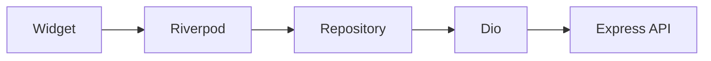

# Flutter Architecture

One Android/iOS (phone and tablet) app. Role decides the view, not a separate binary.

INFRA-001 already has `core/network`, `core/storage`, `core/router`, `core/config`, `core/logging`, Riverpod, GoRouter, Dio, and secure storage. AUTH-001 added `features/auth` and a placeholder `features/home`.

## Target layout

```
apps/mobile/lib/
├── core/
│   ├── network/      # Dio client, interceptors (exists)
│   ├── storage/      # secure storage (exists)
│   ├── router/       # GoRouter (exists)
│   ├── config/       # API_BASE_URL (exists)
│   ├── logging/      # (exists)
│   ├── theme/
│   └── utils/
├── features/
│   ├── auth/
│   ├── home/
│   ├── platform/     # PLATFORM_ADMIN console (PLATFORM-004)
│   ├── campuses/
│   ├── classrooms/
│   ├── students/
│   ├── guardians/
│   ├── attendance/
│   ├── journey/
│   ├── media/
│   ├── notifications/
│   └── transport/
├── shared/
│   ├── widgets/
│   ├── models/
│   └── components/
└── main.dart
```

A feature folder stays thin:

| Piece | Role |
| --- | --- |
| `*.dart` screens / widgets | Layout and interaction only |
| `*.provider.dart` / notifiers | Riverpod state, calls repository |
| `*.repository.dart` | Dio calls, DTO mapping |
| `*.model.dart` | JSON models (json_serializable where useful) |

`shared/` is for widgets used by more than one feature. Do not dump feature-specific cards there.

## Data flow

```
Flutter UI
  → Riverpod (providers / notifiers)
  → Repository
  → Dio / HTTPS
  → REST /api/v1
```



- Widgets watch providers. Widgets do not call Dio.
- Repositories do not navigate or show snackbars.
- Business rules that affect authorization stay on the server. The app may hide buttons the role cannot use; the API still rejects the call.

## Riverpod

Use Riverpod for:

- App-wide dependencies (`apiClientProvider`, `secureStorageProvider` — already exist)
- Session (tokens, current user, roles) after AUTH-001
- Feature state (class roster, timeline)

Keep providers close to the feature. Do not build a global "god" provider.

Auth interceptor (AUTH-001): read access token from secure storage, attach `Authorization`, on 401 attempt refresh once, then send the user to login. Concurrent 401s share one refresh via Dio's `QueuedInterceptor`.

Session `User` already carries `id`, `organizationId`, and `role`. Use `role` to pick Admin / Teacher / Driver / Parent screens later. The API still enforces tenant + RBAC on every call.

## Routing

GoRouter hosts `AuthGate`. Unauthenticated users see the login screen. Authenticated users see a role-scoped home:

- `PLATFORM_ADMIN` → Platform Console (`features/platform`: Dashboard, Organizations, Invitations, Account). No tenant organization context.
- `ADMIN` / `SUPERVISOR` → campuses
- `TEACHER` → my classes
- `DRIVER` → my route
- `GUARDIAN` → my children

Deep links from FCM are handled in NOTIF-001: arrival opens the child dashboard, departure/home drop-off open the journey, media opens photos.

## Platform Admin Flutter flow (PLATFORM-004)

```
Login (PLATFORM_ADMIN, organizationId = null)
  → PlatformShell
       ├── Dashboard          GET /platform/dashboard
       ├── Organizations      GET /platform/organizations?q=&status=
       │     ├── Details      GET /platform/organizations/:id
       │     │     └── Activate / Suspend / Deactivate
       │     └── Create       POST /platform/organizations (+ optional admin)
       ├── Invitations        POST /platform/organizations/:id/admin-invitation
       └── Account            logout
```

Invitation tokens returned by the API are discarded in the repository layer and never shown in the UI. Backend authorization on `/api/v1/platform/*` remains authoritative.

## Platform capabilities (later tickets)

| Capability | Used for | Ticket |
| --- | --- | --- |
| Secure storage | Tokens | AUTH-001 |
| Camera / QR | Attendance, boarding | ATTENDANCE-001 (school arrival), BUS-001 |
| FCM | Push | NOTIF-001 |
| Image picker / camera | Student photos | MEDIA-001 |

QR codes encode only the student's `qrToken`. The app never embeds names, dates of birth, or guardian data in the code. School arrival scans from `features/attendance`; bus boarding scans from `features/transport`. The API remains the security boundary. v1 transport ETA is stop progress plus configured segment times — never shown as live GPS.

## Models vs API

Prefer models that match API JSON. Shared TypeScript in `packages/shared` is still unused; do not generate a mobile package from it until a ticket needs it.
