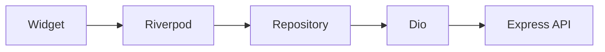

# Flutter Architecture

One Android/iOS (phone and tablet) app. Role decides the view, not a separate binary.

INFRA-001 already has `core/network`, `core/storage`, `core/router`, `core/config`, `core/logging`, Riverpod, GoRouter, Dio, and secure storage. Feature folders are created when their tickets land. ARCH-001 does not add login UI, dashboards, or QR scanning.

## Target layout

```
apps/mobile/lib/
├── core/
│   ├── network/      # Dio client, interceptors (exists)
│   ├── storage/      # secure storage (exists)
│   ├── router/       # GoRouter (exists)
│   ├── config/       # API_BASE_URL (exists)
│   ├── logging/      # (exists)
│   ├── theme/
│   └── utils/
├── features/
│   ├── auth/
│   ├── home/
│   ├── students/
│   ├── attendance/
│   ├── journey/
│   ├── notifications/
│   └── profile/
├── shared/
│   ├── widgets/
│   ├── models/
│   └── components/
└── main.dart
```

A feature folder stays thin:

| Piece | Role |
| --- | --- |
| `*.dart` screens / widgets | Layout and interaction only |
| `*.provider.dart` / notifiers | Riverpod state, calls repository |
| `*.repository.dart` | Dio calls, DTO mapping |
| `*.model.dart` | JSON models (json_serializable where useful) |

`shared/` is for widgets used by more than one feature. Do not dump feature-specific cards there.

## Data flow

```
Flutter UI
  → Riverpod (providers / notifiers)
  → Repository
  → Dio / HTTPS
  → REST /api/v1
```



- Widgets watch providers. Widgets do not call Dio.
- Repositories do not navigate or show snackbars.
- Business rules that affect authorization stay on the server. The app may hide buttons the role cannot use; the API still rejects the call.

## Riverpod

Use Riverpod for:

- App-wide dependencies (`apiClientProvider`, `secureStorageProvider` — already exist)
- Session (tokens, current user, roles) after AUTH-001
- Feature state (class roster, timeline)

Keep providers close to the feature. Do not build a global "god" provider.

Auth interceptor (AUTH-001): read access token from secure storage, attach `Authorization`, on 401 attempt refresh once, then route to login.

## Routing

GoRouter. Routes are role-aware after AUTH-001 (redirect unauthenticated users to login; send roles to the matching home). Until then the placeholder home remains.

Deep links are not required for ARCH-001.

## Platform capabilities (later tickets)

| Capability | Used for | Ticket |
| --- | --- | --- |
| Secure storage | Tokens | AUTH-001 |
| Camera / QR | Attendance, boarding | ATTENDANCE-001, BUS-001 |
| FCM | Push | NOTIF-001 |
| Image picker / camera | Media | MEDIA-001 |

QR codes encode only the student's `qrToken`. The app never embeds names, dates of birth, or guardian data in the code.

## Models vs API

Prefer models that match API JSON. Shared TypeScript in `packages/shared` is still unused; do not generate a mobile package from it until a ticket needs it.
