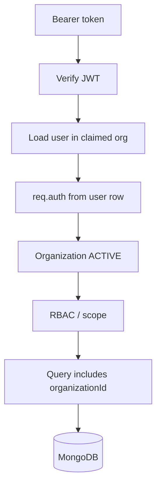

# Multi-Tenancy

Every business request belongs to one organization. Isolation is a backend invariant, not a Flutter convention.

## Model

Shared MongoDB, tenant key on documents:

```json
{
  "_id": "...",
  "organizationId": "...",
  "name": "Sarah"
}
```

`organizations` has no `organizationId`. Users and all operational data do.

Organization fields in v1: `_id`, `name`, `status` (`ACTIVE` | `INACTIVE`), `createdAt`, `updatedAt`.

v1: a user has exactly one `organizationId`. A parent with children at two schools is not supported until a `memberships` collection exists.

## Request path

```
HTTP request
  → authenticate()         JWT verified; user loaded by { _id, organizationId }
  → req.auth               { userId, organizationId, role } from the user row
  → tenantContext()        organization ACTIVE
  → authorize(permission)  see authorization.md
  → repository             tenantFilter(auth.organizationId, …)
  → MongoDB
```



### How tenant context is obtained

From the authenticated user after AUTH-001. Not from:

- `X-Organization-Id` (ignored)
- `organizationId` in JSON body or query string
- Flutter environment variables

Writes use `withTenant(input, auth.organizationId)`, which discards any client `organizationId`.

Invite/accept and login establish the tenant, then issue a token that already contains it. Login also refuses users whose organization is missing or `INACTIVE`.

### How it is validated

1. JWT signature and expiry
2. User exists with `{ _id: sub, organizationId: claim }`, `status === ACTIVE`
3. `req.auth.organizationId` is taken from that user row (claim mismatch → 401)
4. Organization exists and `status === ACTIVE`

Failures: 401 (bad/missing token or disabled/mismatched user) or 403 (org missing or inactive).

## Which collections require `organizationId`

Required: `users`, `refresh_tokens`, `scoped_items` (TENANT-001 probe), and later `campuses`, `classrooms`, `students`, `student_guardians`, `student_events`, `attendance`, `buses`, `routes`, `activities`, `media`, `notifications`.

Not required: `organizations` (the tenant row).

Campuses are not created in TENANT-001; STUDENT-001 introduces campus/classroom documents.

## How repositories enforce isolation

`apps/api/src/data/tenant.ts`:

```ts
findById(organizationId, id)
// filter: tenantFilter(organizationId, { _id: id })
```

Never `{ _id: id }` alone for tenant-owned rows.

List methods start from `{ organizationId }` (and `deletedAt: null` when that field exists) and then add role scope (`classroomId: { $in: assignedIds }`, etc.).

No platform superuser. No admin bypass that omits `organizationId`.

## How cross-tenant access is prevented

| Control | Rule |
| --- | --- |
| Token | `organizationId` is a signed claim; user lookup includes it |
| Writes | Inserts set `organizationId` from `auth` via `withTenant` |
| Reads | Filter includes `organizationId` |
| Unknown id | Return **404** even if the id exists in another org |
| Query / body / header | Client `organizationId` and `X-Organization-Id` are not used for scoping |
| QR (later) | Lookup `{ organizationId, qrToken }`. Other-org token → 404 |
| Indexes | Tenant collections: compound indexes that start with `organizationId` |

Proof in TENANT-001: org A cannot GET/PATCH/DELETE org B rows in `scoped_items`. Student CRUD is STUDENT-001, using the same helpers.

## Scope inside a tenant

Tenant isolation is necessary but not sufficient. After the org filter, [authorization.md](./authorization.md) applies role scope. Empty assignment lists mean **no access**. Only `ADMIN` sees the whole organization.
