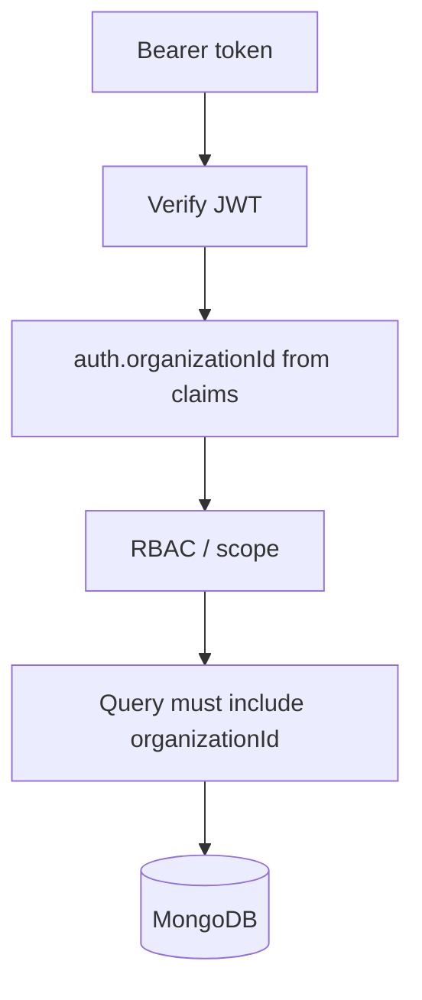

# Multi-Tenancy

Every business request belongs to one organization. Isolation is a backend invariant, not a Flutter convention.

## Model

Shared MongoDB, tenant key on documents:

```json
{
  "_id": "...",
  "organizationId": "...",
  "name": "Sarah"
}
```

`organizations` has no `organizationId`. Users and all operational data do.

v1: a user has exactly one `organizationId`. A parent with children at two schools is not supported until a `memberships` collection exists.

## Request path

```
Authenticated user
  → JWT (sub, organizationId, roles)
  → Middleware copies claims onto req.auth
  → Authorization (role + scope)
  → Repository query { organizationId: auth.organizationId, ... }
  → MongoDB
```



### How tenant context is obtained

From the access token after AUTH-001 / TENANT-001. Not from:

- `X-Organization-Id` headers the client can spoof
- `organizationId` in the JSON body as the sole source
- Flutter environment variables

Body `organizationId` is ignored for scoping. The service uses `auth.organizationId`.

Invite/accept and login are the exceptions: they establish the tenant, then issue a token that already contains it.

### How it is validated

1. JWT signature and expiry
2. User exists, `status === ACTIVE`, `deletedAt` is null
3. `user.organizationId` equals the claim
4. Organization `status === ACTIVE`

Failures: 401 (bad/missing token or disabled user) or 403 (org suspended).

## Which collections require `organizationId`

Required: `campuses`, `classrooms`, `users`, `students`, `student_guardians`, `student_events`, `attendance`, `buses`, `routes`, `activities`, `media`, `notifications`.

Not required: `organizations` (the tenant row).

## How repositories enforce isolation

Every tenant repository method takes `organizationId` as a required argument (first parameter, not optional).

```ts
findById(organizationId: ObjectId, id: ObjectId)
```

The Mongo filter is always `{ _id: id, organizationId }`. Never `{ _id: id }` alone.

List methods start from `{ organizationId, deletedAt: null }` and then add role scope (`classroomId: { $in: auth.classroomIds }`, etc.).

No generic `admin` bypass that omits `organizationId` in v1. There is no platform superuser in this architecture.

## How cross-tenant access is prevented

| Control | Rule |
| --- | --- |
| Token | `organizationId` is a signed claim |
| Writes | Inserts set `organizationId` from `auth`, never from the client |
| Reads | Filter includes `organizationId` |
| Unknown id | Return 404 even if the id exists in another org |
| QR | Lookup `{ organizationId, qrToken }`. A token from another org is 404 |
| Media | Signed URL issued only after a tenant + student-scope check |
| Indexes | Compound indexes start with `organizationId` so isolation is the access path |

Automated tests in TENANT-001 must include: user A cannot GET/PATCH user B's student by id.

## Scope inside a tenant

Tenant isolation is necessary but not sufficient. After the org filter:

| Role | Extra filter |
| --- | --- |
| ADMIN | Organization |
| SUPERVISOR | `campusId ∈ user.campusIds` (empty campusIds = no rows, not all rows) |
| TEACHER | `classroomId ∈ user.classroomIds` |
| DRIVER | Students on `user.routeIds` |
| GUARDIAN | Students in `student_guardians` for `userId` |

Empty assignment lists mean **no access**, not full-org access. Only `ADMIN` sees the whole organization.
